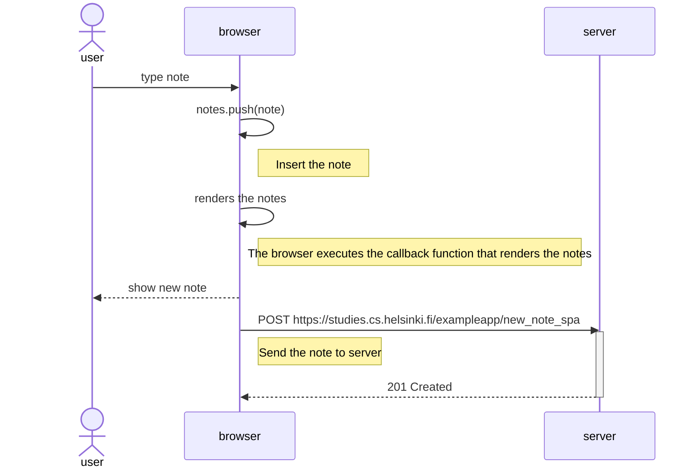

```mermaid

sequenceDiagram
    actor user
    participant browser
    participant server

   

    user->>browser: type note
    browser->>browser:notes.push(note)
    Note right of browser:Insert the note
    browser->>browser:renders the notes
    Note right of browser: The browser executes the callback function that renders the notes
    browser-->>user:show new note
    
    browser->>server: POST https://studies.cs.helsinki.fi/exampleapp/new_note_spa
    activate server
    Note right of browser:Send the note to server
    server-->>browser:  201 Created
    deactivate server
    
  
  

```